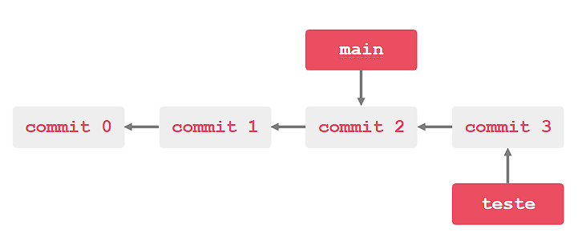

# Trabalhando Com Branches

## O que é uma Branch?
- É uma ramificação do seu projeto que você utiliza para testar novas funcionalidades **sem afetar o projeto/branch principal**.

- Quando vocÊ cria uma nova Branch a partir de outra existente, a nova se inicia apontando para o mesmo commit da Branch que foi criada.

- Então, quando você faz novos commits a partir da nova, ele segue pela nova ramificação deixando a main/pricipal para trás.

## Visualize para entender!
#### Feito no repositório ``trabalhando-com-branches``


## Como criar uma nova Branch?
Para criar uma nova branch e ir para ela você deve digitar:
- ANTES : trabalhando-com-branches (main)
```
git checkout -b <nome da branch>
```
- DEPOIS: trabalhando-com-branches (teste)

## Para listar todas as branches:
```
git branch -v
```
## Para mesclar commits/alterações, ou seja, para a main ter as mesmas alterações da nova branch
Caso queira que as alterações na branch teste APAREÇA na branch main, temos que MESCLAR/MERGEAR:
```
git merge <nome da branch que você quer incluir na main>
```


## Conflitos de Branch 

#### Merge
Se um repositório tem alterações já feitas na mesma branch e você quer mergear, FAÇA: 

- UM PULL

Se der outro conflito:
- LEIA O QUE O GIT LHE DIZ! ELE É SEU MELHOR AMIGO NESSAS HORAS 💁🏽‍♀️

- Por fim, converse sobre qual versão deve ser mantida.